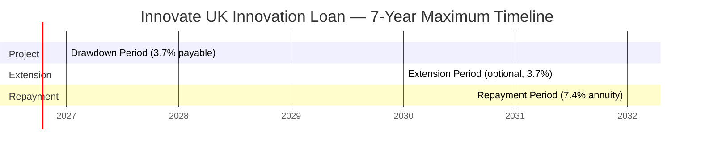
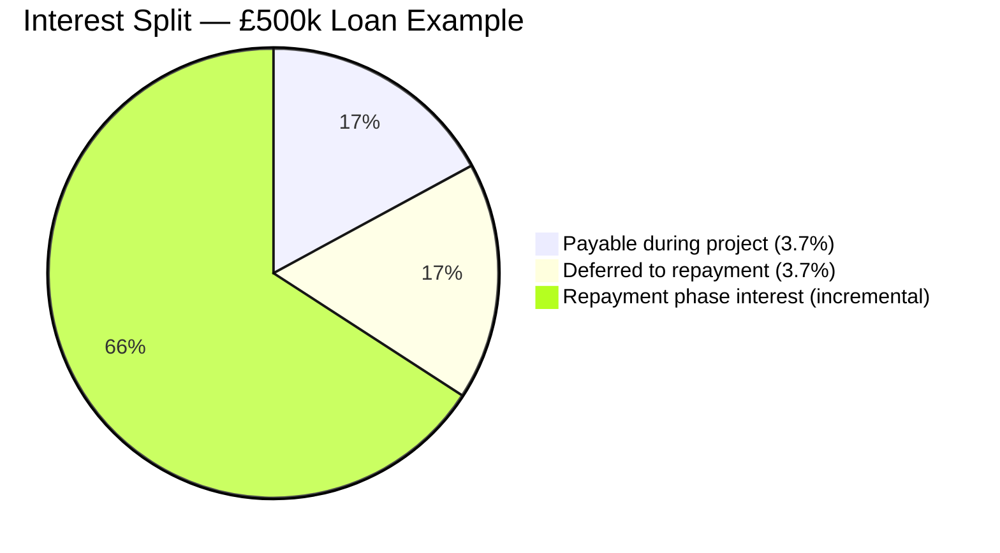

# Financial Mechanics — How the Loan Works

## Loan Amount
- **Range:** £100,000 – £5,000,000
- **100% of eligible project costs** covered

---

## The Three-Phase Interest Structure

---

**Note:** The deferred interest (£18,500 on a £500k full-year draw) is small because the 3.7% deferred accumulates on the outstanding principal, not the full loan amount. Total interest over 7 years on a £500k loan drawn at start ≈ £108,326.

This is the most important thing to understand. The 7.4% rate is split:

| Phase | Duration | Interest Rate | What Happens |
|---|---|---|---|
| **Project Period** (Drawdown) | Up to 3 years | 3.7% payable | Pay interest quarterly on amounts drawn. No principal repayments. |
| **Extension Period** (optional) | Up to 2 years | 3.7% payable | Same as project period. |
| **Repayment Period** | Up to 5 years | 7.4% on principal + deferred interest | Principal + all deferred interest (both the 3.7% deferred during project + the deferred extension interest) repaid. |

**Total maximum loan life: 7 years (3 + 2 + 5, or earlier if project is shorter)**

---

## Worked Example: £500,000 Loan

### Assumptions
- Loan: £500,000
- Project period: 2 years (8 quarters of drawdown)
- Drawn in full at start of Q1
- Extension period: 0 years
- Repayment period: 5 years (20 quarters)

### During Project (Year 1-2)
- Payable interest: 3.7% × £500,000 = **£18,500/year** = £4,625/quarter
- Deferred interest accrues: 3.7% × £500,000 = **£18,500/year**
- Total deferred after 2 years: **£37,000**

### At Repayment Start (End of Year 2)
- Principal outstanding: £500,000
- Deferred interest accrued: £37,000
- Total to repay: **£537,000**

### During Repayment (Years 3-7)
- Now attracts 7.4% on the whole £537,000
- Repaid over 20 quarters (quarterly instalments, annuity-style)

**Total interest paid over life of loan ≈ £143,000** (approx, varies with exact drawdown timing)

---

## Drawdown Mechanics

- Drawdowns are **quarterly in advance**
- Staged and tied to **project milestones**
- Milestones are agreed in the loan documentation
- You request a drawdown; IUK releases funds if milestone evidence is satisfactory
- You can repay early **without penalty**

**Practical implication:** Structure milestones carefully in your application. Front-loading capital purchases without justification invites scrutiny.

---

## Security: The Debenture

### What it is
A debenture is a **fixed charge over business assets**. It gives IUK Loans Ltd security over your company's assets (equipment, IP, trade receivables, etc.) if you default.

### What it means practically
- **No personal guarantees** are required (unlike a personal guarantee on a bank loan)
- IUK registers the charge at Companies House
- If you default, IUK can crystallise the charge and sell assets to recover the debt
- The debenture is typically **first ranking** (they get paid first from asset sales)

### What it does NOT mean
- Your home is not at risk
- Directors' personal assets are not pledged
- IP and intangible assets do **not** need to be independently valued — the loan is not secured on IP value, it is secured on the company's asset base

### What you're committing to
- Not to grant a superior charge to another lender without IUK's consent
- To maintain adequate insurance on secured assets
- To keep assets in good condition
- To notify IUK of any material changes to the business

---

## Pre-Revenue Businesses — The Eligibility Clarification

### What "pre-revenue businesses with no external funding" actually means

The disqualifier is: **pre-revenue + no plan + no means to raise funding** — i.e., a business with no traction, no investors, no LOIs, sitting with an idea and asking IUK to fund it alone.

**The clause is NOT about you needing a closed funding round before applying.** It means:
1. You must be actively pursuing private capital alongside (not instead of) the IUK loan
2. You cannot use the IUK loan to substitute for equity fundraising you should be doing
3. The "funding gap" the loan fills must be genuinely unmet by private markets

### What IUK wants to see from a pre-revenue company with funding plans

The EOI asks you to describe your "broader fundraising strategy." The key sentence they want:

> *"We are raising equity / have revenue / have X in place, and the IUK loan bridges the specific gap that equity alone cannot cover at this stage."*

| Situation | Eligible? |
|---|---|
| Pre-revenue, actively fundraising, LOIs/pilots in hand | ✅ Likely yes |
| Pre-revenue, have a clear equity funding plan | ✅ Likely yes |
| Pre-revenue, no external funding plans, no traction | ❌ No |
| Pre-revenue, turning to IUK because equity said no | ⚠️ Risky — must show why private capital truly unavailable |

### The Kanay-specific position

From the investor materials reviewed:
- **SAFE instruments** (Friends & Family) — active with MFN + priority payout clauses
- **Convertible Note** (£10M, April 2024) — 8% p.a., Nvidia DGX GPU collateral, Dec 2029 maturity
- **Short/Long Term Sheets** — SEIS/EIS eligible preference shares; Seed round in progress
- **Floating Wind JV** — project IRR 34%, equity IRR 52%, 1.9yr payback (most credible projections)
- **Current fundraise** — actively seeking institutional investment alongside this IUK loan

This is the "broader funding strategy" the EOI asks you to describe. The IUK loan sits alongside the equity instruments, not in place of them.

---

## Financial Covenants (Thresholds to Maintain)

During repayment, you must maintain:
- **Liquidity ratio:** minimum 1.1x
- **Debt Service Coverage Ratio (DSCR):** ≥ 1.2x

These are tested quarterly via management accounts.
You must submit:
- Quarterly management accounts
- Annual audited accounts

---

## How the EOI Slides into the Full Application

The EOI is a **gate**, not a scored competition. IUK is screening for:
1. Eligibility (company + sector)
2. Innovation quality (late-stage R&D, not early stage)
3. Commercial viability (route to market, repayment ability)
4. Financial robustness (balance sheet, cash, creditworthiness)

The full application goes deeper — they will pull credit reports, scrutinise management accounts, and assess your capacity to handle multiple projects.
