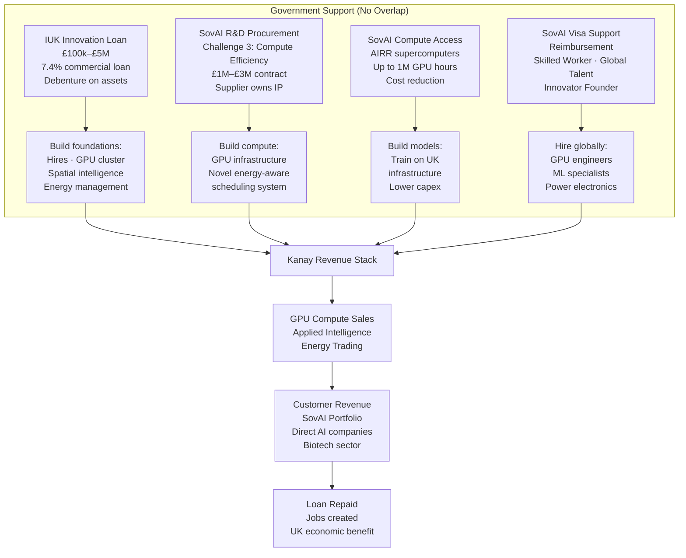

# Appendix — Kanay + Sovereign AI Funding Stack

> **Legal framing:** None of these instruments are state aid in the traditional grant sense. The IUK Innovation Loan is a commercial loan to be repaid with a debenture. Sovereign AI equity is market-rate investment. SovAI R&D Procurement is a government contract under the Procurement Act 2023. The only constraint is contract law: you cannot invoice two parties for the same work. These are three distinct instruments with distinct counterparties, distinct costs, and distinct outputs.

---

## Kanay's Four SovAI Instruments (Excluding Equity)

Kanay is **not seeking Sovereign AI equity investment**. Kanay is pursuing four distinct SovAI support mechanisms:

## Why Contact Sovereign AI Now

> *"No AI company will flourish without compute for inference, decisions, and training."*

Sovereign AI's portfolio companies — Basecamp Research, OLIX, CuspAI, Isomorphic Labs, Ineffible Intelligence — are all GPU buyers. They need compute. Kanay is building compute infrastructure.

Approaching Sovereign AI today as a **potential supplier** — not an equity seeker — means:
- Getting on SovAI's radar before the procurement competition
- Being introduced to portfolio companies as a preferred compute supplier
- Access to matched funding mechanisms (debt, grants) through SovAI's wider ecosystem
- Early access to AIRR compute access when the next round opens

**The conversation to open with Sovereign AI:**
> *"Kanay is building energy-aware GPU compute infrastructure. We are not seeking equity. We want to supply UK AI companies — including your portfolio — with compute at prices that only our energy model can offer. We will need global talent to build this — your visa support removes the cost barrier. We want to be on your radar as a supplier."*

---

### 1. R&D Procurement Contract
**What:** Government buys novel AI R&D as a customer under the Procurement Act 2023.
**Challenge fit:** Challenge 3 — compute efficiency.
**Value:** £1M–£3M per contract.
**IP:** Kanay owns all IP; government gets a usage licence.
**Timeline:** Batch 2 deadline 31 Dec 2026.

### 2. AI Research Resource (AIRR) — Sovereign Compute Access
**What:** Up to 1M GPU hours on UK supercomputers (Isambard, DAWN).
**Value:** Reduces Kanay's cost to build the spatial intelligence layer.
**Timeline:** Apply when next round opens (currently closed).
**Eligibility:** Requires substantive UK-based AI R&D in strategic areas.

### 3. Strategic Assets Programme
**What:** Pre-competitive data infrastructure funding.
**Kanay angle:** KCC taxonomy as domain-specific spatial dataset. Consortium bid with universities for geospatial AI data infrastructure.
**Timeline:** Monitor sovereignai.gov.uk for next funding round.

### 4. Visa Reimbursement Scheme
**What:** Reimbursement of visa costs for hiring global AI talent.
**Value:** Skilled Worker, Global Talent, Innovator Founder routes covered.
**Eligibility:** Available once Kanay has a SovAI procurement contract or compute allocation.
**Timeline:** Activates once first SovAI instrument is confirmed.

---

## IUK Innovation Loan — Foundation Layer (Maximum £5M)

**Purpose:** Build the foundations that make Kanay fundable by Sovereign AI and commercially viable.

| What the £5M funds | Why it matters |
|---|---|
| First 10 technical + commercial hires | Team to build and sell |
| Initial GPU cluster (H100, containerised) | Compute capacity for first customers |
| Spatial intelligence layer (core development) | Applied intelligence v1 — the differentiator |
| Energy management system | Power cost optimisation, battery control |
| Working capital (20% = £1M) | Customer trials, first pilots |
| **Total deployment** | **Foundations in place, first revenue in Y1** |

---

## What the IUK Loan Unlocks

- **SovAI equity:** Now fundable with foundations in place
- **SovAI procurement:** Can bid Challenge 3 with working infrastructure
- **Direct GPU customers:** Revenue from month 1
- **Compute-for-equity:** Build ecosystem without cash outflow

---

## Applied Intelligence — The Commercial Thesis

The differentiator is not compute alone. Every GPU cluster sells compute hours.

The differentiator is **applied intelligence**:
- Domain expertise embedded in the model layer
- Proprietary taxonomy that classifies and structures market data
- Sector-specific overlays: energy trading, biotech, freight
- Customer's standard system mapping: GICS, NACE, HS codes

This is what makes compute sticky. Customers rent GPU hours **and** intelligence.

---

## Revenue Model

```
GPU Compute Sales
├── Via Sovereign AI fund → UK AI companies (SovAI portfolio)
├── Direct → UK AI companies
├── Direct → European biotech firms
├── Direct → US biotech firms
└── Compute-for-equity → Early AI companies (no cash required)

Applied Intelligence Licensing
├── Spatial intelligence API
├── Sector-specific model overlays
└── KCC taxonomy access

Energy Trading
├── Battery storage arbitrage
├── Renewable power trading
└── Grid services (ancillary markets)
```

---

## Funding Flow Diagram



---

## Timeline

```mermaid
gantt
    title Kanay — Funding Timeline
    dateFormat  YYYY-MM-DD
    axisFormat  %b %Y

    section IUK Loan
    EOI Submission           :crit, i1, 2026-10-09, 1d
    EOI Review              :i2, 2026-10-10, 2026-11-01, 21d
    Full Application         :i3, 2026-11-02, 2026-12-01, 30d
    Loan Drawn              :crit, i4, 2026-12-01, 2027-01-15, 45d

    section SovAI
    Contact SovAI (now)     :s1, 2026-10-02, 2026-10-10, 8d
    Approved Supplier List   :s2, after s1, 14d
    Batch 2 Submission      :crit, s3, 2026-12-31, 1d
    Batch 2 Outcome         :s4, 2027-01-29, 1d
    Contract Signed          :s5, after s4, 30d

    section Revenue
    First GPU Customers     :r1, 2027-03-01, 2027-06-30, 120d
    Applied Intelligence v1  :r2, 2027-03-01, 2027-06-30, 120d
    Energy trading live     :r3, 2027-06-01, 2027-09-30, 120d
```
NOW
├── Apply to SovAI Approved Supplier List (no deadline)
├── Prepare IUK Innovation Loan EOI (deadline 9 Oct 2026)
└── Begin SovAI equity conversation (equity not sought, but relationship matters)

9 Oct 2026
└── Submit IUK Innovation Loan EOI

Oct–Dec 2026
├── IUK full application (if EOI approved)
├── SovAI Batch 2 application prep (Challenge 3)
└── First GPU compute customer conversations

31 Dec 2026
└── SovAI Batch 2 submission (Challenge 3: compute efficiency)

Jan 2027
├── SovAI Batch 2 outcome (government contract?)
├── IUK full application
└── Monitor AIRR next round (compute access)

Q1 2027
├── IUK loan drawn down
├── Core infrastructure built
├── Applied intelligence v1 shipped
└── Visa reimbursement activates (once SovAI instrument confirmed)
```
