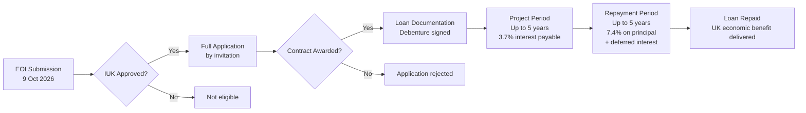
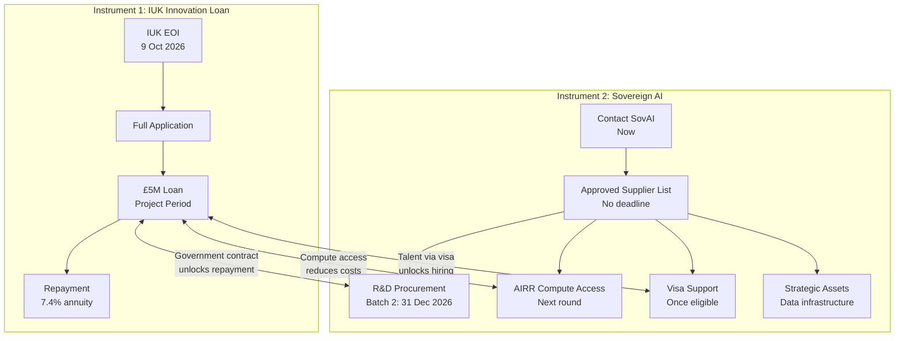
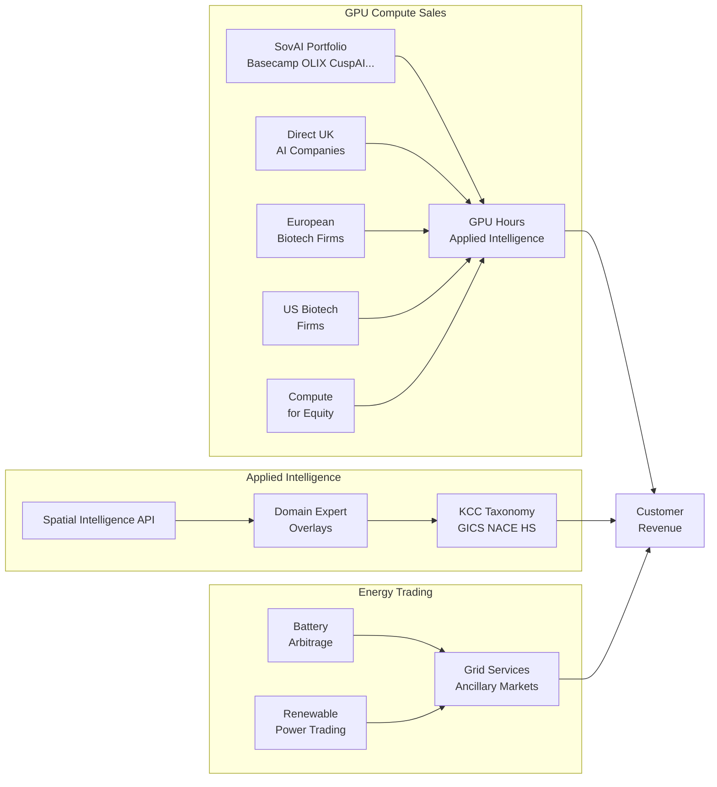

# Innovate UK Innovation Loan — Working Repository

**EOI Deadline:** 9 October 2026, 11:00am (last window for 2026)
**Loan Amount:** £100k – £5M
**Interest:** 7.4% p.a. (3.7% payable during project, 3.7% deferred)
**Project Start:** From 1 December 2026

---

## Repository Structure

```
01-eligibility/                      ← Eligibility checklist, sector guide, exclusions
02-financial-mechanics/               ← Loan mechanics, drawdowns, debenture, pre-revenue clarity
03-due-diligence/                   ← What IUK checks, covenant thresholds, red flags
04-eoi-draft/                      ← EOI project summary template + the 11 questions
05-financial-models/                 ← R + Python models (drawdown, amortisation, DSCR)
06-presentation/                    ← OpenDesign pitch deck materials
07-revenue-customers-commercialisation/
  sovai/
    README.md                      ← SovAI full overview — all 5 offerings
    procurement/                    ← R&D procurement scheme, Challenge 3
    compute-access/                ← AI Research Resource sovereign compute
    strategic-assets/              ← Data infrastructure funding
    visa-support/                  ← Global talent visa reimbursement
08-iuk-competition-2505/           ← Full competition brief, FAQs, webinars
references/                        ← All citations and sources
```

---

## The 2-Stage Process



---

## Kanay's Dual-Track Strategy



---

## Kanay Revenue Stack



---

## The 2-Stage Process

```
EOI (deadline 9 Oct 2026)
    ↓  (if approved)
Full Application (by invitation)
    ↓  (if approved)
Loan Documentation → Debenture → Quarterly Drawdowns
    ↓
Project Period (up to 5 years, interest payable at 3.7%)
    ↓
Repayment Period (up to 5 years, principal + deferred interest at 7.4%)
```

---

## Kanay's Dual-Track Strategy

```
Sovereign AI R&D Procurement (Batch 2, Dec 2026)
    → Government as first customer
    → Challenge 3: compute efficiency
    → IP: Kanay owns; government gets usage licence

Innovate UK Innovation Loan (EOI 9 Oct 2026)
    → Debt layer preserving equity
    → Energy trading infrastructure + commercial operations
    → Separate work package from SovAI contract
```

---

## Key Links
- IUK Portal: https://apply-for-innovation-funding.service.gov.uk
- Competition: https://apply-for-innovation-funding.service.gov.uk/competition/2505/overview
- IUK Loans guidance: https://www.ukri.org/councils/innovate-uk/guidance-for-applicants/guidance-for-specific-funds/innovation-loans/
- SovAI: https://www.sovereignai.gov.uk
- SovAI EOI: https://www.sovereignai.gov.uk/requestforfounders
- Support: support@iuk.ukri.org | 0300 321 4357

---

## Tags
#innovation-loan #iuk #eoi #2026 #sovereign-ai
